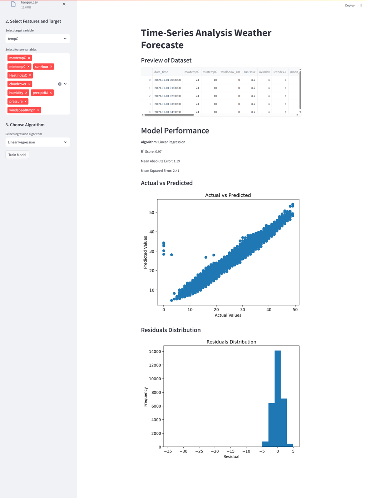

# ⏱️ Time-Series Analysis

[](LICENSE)


This repository provides a comprehensive solution for time series forecasting using Python. It covers data preprocessing, analysis, modeling, and deployment through a Streamlit web application.

---

## 🧠 Key Features

- 📦 Clean and preprocess raw time series data
- 📊 Visualize and decompose time series trends and seasonality
- 🔮 Build forecasting models
- 📈 Interactive forecasts using Streamlit
- 🧪 Jupyter Notebook for experimentation

---

## 📁 Project Structure

| File/Folder    | Description |
|----------------|-------------|
| `forecast.ipynb` | Full EDA and forecasting workflow in a notebook |
| `app.py`         | Streamlit app to interactively forecast data |
| `kanpur.csv`     | Primary dataset |
| `DataSet.txt`    | Supplementary dataset |
| `requirements.txt` | Python dependencies |

---

## 📷 Preview




---

## 🚀 Getting Started

### ✅ Prerequisites

- Python 3.7 or higher
- pip

### 🛠️ Installation

```bash
git clone https://github.com/Apurba-01/Time-Series_Analysis.git
cd Time-Series_Analysis
python -m venv venv
source venv/bin/activate  # On Windows: venv\Scripts\activate
pip install -r requirements.txt
```

---

## 🧪 Usage

### 🔍 Jupyter Notebook

To explore analysis and modeling steps:

```bash
jupyter notebook forecast.ipynb
```

### 🌐 Run the Web App

To launch the forecasting web app:

```bash
streamlit run app.py
```

Then open the link in your browser.

---

## 📄 License

This project is licensed under the MIT License. See the [LICENSE](LICENSE) file for details.

---

## 🙏 Acknowledgments

Created and maintained by [Apurba-01](https://github.com/Apurba-01)

---

*Feel free to contribute or suggest improvements!* 🚀
